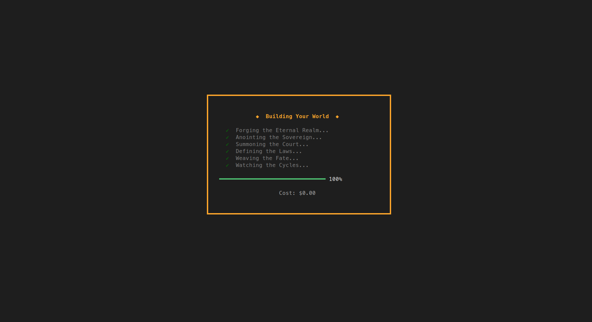
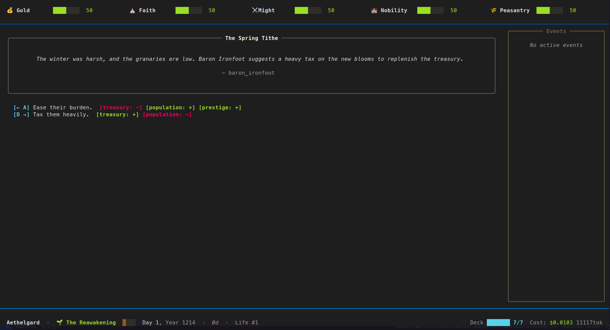

# World Card AI 🃏

> A terminal card survival game powered by AI. Every world is unique, every choice matters, and death is never the end.





---

## Overview

**World Card AI** is a [Reigns](https://store.steampowered.com/app/474750/Reigns/)-inspired terminal game where you rule a kingdom by swiping left or right on decision cards. Unlike traditional card games, every world and every card is generated by Large Language Models — your kingdom's story, NPCs, politics, and crises are unique to each playthrough.

The game runs entirely in your terminal using the [Textual](https://textual.textualize.io/) framework and communicates with any OpenRouter-compatible LLM via LangChain.

---

## Features

- 🌍 **AI-Generated Worlds** — The Architect LLM designs the world: its era, factions, characters, stats, seasons, and an entire branching plot graph.
- 📜 **Dynamic Storytelling** — The Writer LLM generates a fresh deck of decision cards each season, informed by your current state: stats, active events, tags, and plot progress.
- 🧬 **Season-Based Life Cycle** — The game is structured around seasons (Spring → Summer → Autumn → Winter). Each season starts with a narrative introduction. Death skips you to the next season; your karma and story choices carry forward.
- ⚔️ **Function-Calling Actions** — Card choices execute typed functions (`update_stat`, `add_event`, `enable_npc`, `add_tag`, etc.) rather than raw stat diffs, enabling rich and composable effects.
- 🕸️ **Plot DAG** — The Architect defines a branching macro-story graph with multiple endings. Plot nodes unlock and fire as you meet conditions throughout your reign.
- 📅 **Event System** — Four event types: `phase` (multi-stage), `progress` (goal-based), `timed` (deadline-driven), and `condition` (trigger-based). Events persist across seasons.
- ♾️ **Reincarnation** — On death, you are reborn in the next season. Tags and karma carry over. Your resurrection mechanic is defined by the AI when the world is created.
- 🎮 **Demo Mode** — Play offline without an API key using a pre-built medieval kingdom world.

---

## Screenshots

> _(Terminal-based UI — see it live by running the game!)_

---

## Requirements

- Python 3.10+
- An [OpenRouter](https://openrouter.ai/) API key (for full AI mode)

---

## Setup

### 1. Clone the repository

```bash
git clone https://github.com/your-username/world-card-ai.git
cd world-card-ai
```

### 2. Install dependencies

```bash
pip install -r requirements.txt
```

### 3. Configure environment

Copy the example `.env` file and fill in your credentials:

```bash
cp .env.example .env
```

Edit `.env`:

```env
OPENROUTER_API_KEY=sk-or-...

# Optional: override the default model names
HEAVY_MODEL=google/gemini-2.5-pro     # Used by the Architect (world gen)
FAST_MODEL=google/gemini-2.5-flash   # Used by the Writer (card gen)
```

If `HEAVY_MODEL` or `FAST_MODEL` are not set, the defaults above are used.

---

## Running

### Full AI Mode

```bash
python main.py
```

Launches the world creation screen. The Architect LLM will generate a unique world based on your chosen theme. Then the Writer LLM will generate cards every season, live during gameplay.

### Demo Mode (no API key required)

```bash
python main.py --demo
```

Loads the pre-built **Kingdom of Ardenvale** world and uses a hand-crafted card pool. No network calls are made.

---

## Controls

| Key | Action |
|-----|--------|
| `←` / `A` | Swipe left |
| `→` / `D` | Swipe right |
| `Q` | Quit |
| `~` | Toggle cheat/debug panel |

---

## Architecture

```
world-card-ai/
├── main.py              # Entry point + CLI args
├── agents/              # LLM agents
│   ├── architect.py     # World generation (streaming, sectioned output)
│   ├── writer.py        # Card generation (batch per season)
│   ├── schemas.py       # Pydantic models: WorldGenSchema, CardDef, ...
│   ├── client.py        # OpenRouter LLM client (heavy/fast models)
│   └── prompt_loader.py # Jinja2 template renderer
├── prompts/             # Jinja2 prompt templates
│   ├── architect_system.j2
│   ├── architect_user.j2
│   ├── writer_system.j2
│   └── writer_user.j2
├── game/                # Core game engine and state
│   ├── engine.py        # GameEngine: card draw, resolution, death, plot
│   ├── state.py         # GlobalBlackboard (Pydantic): all game state
│   ├── events.py        # Event models (phase, progress, timed, condition)
│   ├── job_queue.py     # Async card-generation job queue
│   ├── demo.py          # Pre-built demo world + card pool
│   └── cost.py          # Token cost tracker
├── cards/               # Card models and logic
│   ├── models.py        # Card, ChoiceCard, InfoCard, Choice
│   ├── deck.py          # WeightedDeque (priority-based card deck)
│   ├── resolver.py      # ActionExecutor: applies function calls to state
│   └── validator.py     # Validates + converts CardDef → Card
├── death/               # Death and resurrection system
│   └── loop.py          # DeathLoop: detects stat boundaries, karma
├── story/               # Plot graph (DAG)
│   └── dag.py           # MacroDAG: node activation, ends, firing
└── ui/                  # Textual TUI
    ├── app.py           # WorldCardApp (root)
    ├── screens/         # Screens: loading, world, game, cheat, ending
    └── widgets/         # Widgets: card view, stats bar, deck counter, timeline, ...
```

---

## Game Loop

1. **World Creation** — The Architect streams a `WorldGenSchema`: stats, NPCs, relationships, seasons, tags, and a plot DAG with 3–4 endings.
2. **Season Start (Day 1)** — The Writer generates a full batch:
   - 7 common choice cards
   - 1 Welcome or Reborn info card (first life / after death)
   - 1 Season narrative card
   - 2× N death cards (one per stat × min/max boundary)
3. **Playing** — You are shown one card per action. Swipe left or right to execute the choice's function calls (stat changes, events, NPC state, tags).
4. **Events** — Active events persist across seasons and display in the sidebar. Some unlock new cards when they end.
5. **Plot** — After each action, plot conditions are checked. If met, the next plot node fires at week end, injecting a narrative card.
6. **Death** — If a stat hits 0 or 100, a pre-generated death card is shown. Swiping it triggers resurrection.
7. **Resurrection** — The calendar advances to the next season. Tags and karma carry over. A Reborn card narrates the transition.
8. **Ending** — Reaching an ending plot node switches to the ending screen.

---

## State Carried Across Lives

When you die and are reborn, the following state persists:

- ✅ Tags (acquired story flags)
- ✅ Karma (list of past life highlights)
- ✅ Plot nodes (already fired nodes remain fired)
- ✅ Life number

The following state is reset:

- ❌ Stats (return to 50)
- ❌ Active events
- ❌ NPC enable/disable state

---

Here is the structured markdown to-do list, sếp.

## Project Tasks

* [ ] Save world
* [ ] Generate avatars and character images as SVGs using LLM (e.g., low poly style)
* [ ] Implement a mechanism to increase/decrease stats after each season
* [ ] Add an `assistant` NPC. This special NPC provides a third dialogue/action option (mapped to the Down arrow or `S` key) designed to balance the player's current stats. This should typically serve as the optimal choice among the three available options.
* [ ] Enable streaming for generated cards
* [ ] Add AI-generated hints prior to each season
* [ ] Implement an "undo last action" feature
* [ ] Update progression logic: Configure the system to save a user checkpoint at the beginning of each season rather than skipping directly to the next season
* [ ] A NPC should have a card to introduce them when they are first introduced
* [ ] Player chacracter and NPCs should age each season, and the LLM should be aware of this when generating cards (e.g., "Your trusted advisor is now an old man nearing the end of his life. Do you...")
* [ ] Add a "legacy" system where certain achievements or milestones from past lives can unlock special cards or options in future lives (e.g., "Because you successfully defended the kingdom from a dragon in a past life, you have the option to call upon the Dragon's Aid in this life")
* [ ] Use Lua as the scripting language for card effects instead of Python eval.
---

Would you like me to expand any of these items into smaller, actionable sub-tasks?

## Contributing

Pull requests are welcome. Please open an issue first for major feature changes.

---

## License

MIT
